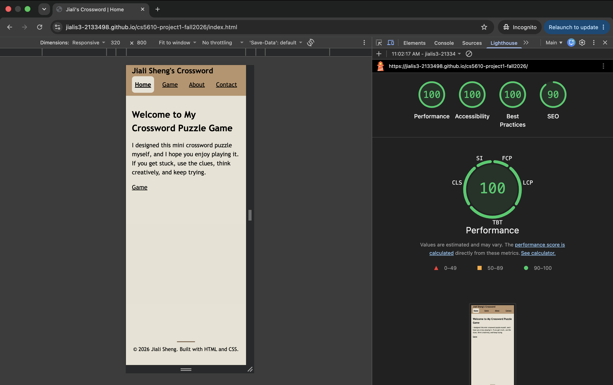
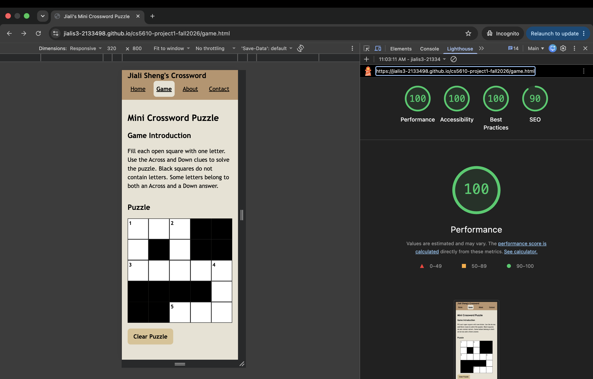
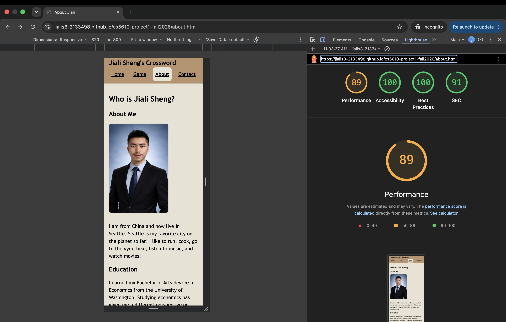
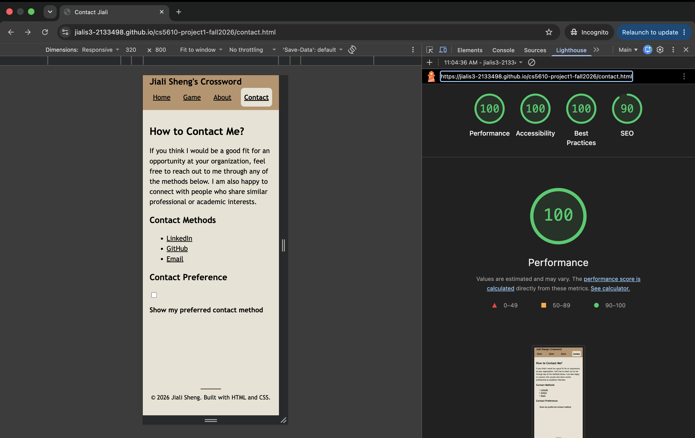

# cs5610-project1-fall2026 - Jiali Sheng

## Write Up Questions

### Q1: What was the most challenging part of this assignment? Did you find HTML and CSS easy or difficult to work with?

For me, the most challenging parts of this assignment involved several different areas. First, I had never played a crossword puzzle before, so understanding the game rules and the structure of the puzzle board was challenging. Second, adjusting values for margins, padding, and spacing was also difficult because I often had to switch back and forth between `style.css` and the browser to see how each change affected the layout. I overcame these challenges by learning the basic rules of crossword puzzles and reviewing the course lecture slides about spacing and layout.

I found HTML easier to work with than CSS. However, I also learned that CSS plays a crucial role in creating an accessible, responsive, and well-designed webpage.

### Q2: How did you build the puzzle grid, and what other options did you consider?

I followed the approach introduced in the course lectures and built the puzzle using 25 separate `
` elements. I displayed those elements using CSS Grid, specifically with `grid-template-columns: repeat(5, 1fr)`. I also considered using Flexbox, but I realized that CSS Grid was more appropriate because the crossword requires a two-dimensional layout with both rows and columns.

### Q3: What did you take into account when designing the site? Is there anything you are particularly proud of?

When designing the site, I considered font hierarchy, font family, color combinations, responsive layout, the arrangement of different sections on the Game page, accessibility, and the overall playing experience. I am particularly proud of two parts of the site. First, I chose a color palette from W3Schools that I think matches my personality and gives the site a warm and consistent visual style. Second, I implemented a `Clear Puzzle` button on the Game page so that users can easily reset the crossword without refreshing the page.

### Q4: Given more time or resources, what would you add?

With more time or resources, I would add more visual content to the Landing and Game pages to make the website more engaging. I would also add a `Dark Mode` option so that users could adjust the appearance of the site based on their preferences. In addition, I would consider adding more games in the future while keeping the same responsive and accessible design.

### Q5: How many hours did you spend on this assignment?

I spent approximately 15 hours on this project.

### Q6: If you used code or design from anywhere online (including AI), say so here. If you imported a font or icon library, or adapted an existing puzzle, note that as well.

I used ChatGPT to help me understand the rules of crossword puzzles and to help generate and review the puzzle words and clues. I also used ChatGPT for explanations of HTML and CSS concepts, such as `:hover`, responsive design, and accessibility, as well as for debugging suggestions. I wrote and implemented all the HTML and CSS code myself based on the course material and my own design decisions. I learned about the Navbar, CSS Grid, Flexbox, and other components from the course lectures. For the webpage color palette, I referenced the W3Schools color palette website [1].

[1]: https://www.w3schools.com/colors/colors_palettes.asp

## Lighthouse Score

#### I used Lighthouse in Mobile mode because this project emphasizes responsive design and specifically requires the site to work well on small screens.

### Home Page
 

### Game Page
 

### About Page
 

### Contact Page
 